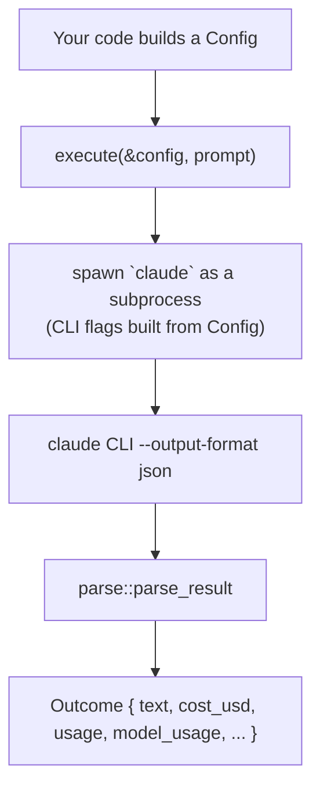

# claude-sdk-rs

[](https://crates.io/crates/claude-sdk-rs)
[](https://docs.rs/claude-sdk-rs)

A lean async Rust SDK that runs the [Claude Code](https://claude.ai/code) CLI as a subprocess,
authenticated through a flat-rate Claude subscription rather than metered API credits. If you
already pay for Claude Code, this crate lets you call it programmatically from Rust without a
separate API key or per-token billing.

**2.0.0 is a ground-up rewrite of the `claude-sdk-rs` 1.x line, with no migration path.** See
[CHANGELOG.md](./CHANGELOG.md) for what changed and why. If you depend on 1.x, pin
`claude-sdk-rs = "=1.0.2"` — that version is frozen on the
[`legacy-v1`](https://github.com/bredmond1019/claude-sdk-rs/tree/legacy-v1) branch.

## Why a subprocess wrapper instead of an HTTP client

- **Subscription auth, not metered API keys.** Every call rides your existing Claude Code login —
  no separate API billing to configure or reconcile.
- **Schema locked to captured CLI output, not memory.** `tests/fixtures/` holds real captured CLI
  responses; `tests/parse_schema.rs` asserts against them, and an ignored canary test diffs live
  CLI output against the fixtures on demand — so a CLI schema change surfaces as a failing test,
  not silent drift in production. Provenance and re-capture steps: `tests/fixtures/README.md`.

## Prerequisites

| Requirement | Notes |
|---|---|
| A Rust toolchain (stable, via rustup) | Edition 2021. CI (`.github/workflows/ci.yml`) gates on `stable`; there is no pinned MSRV, so use whatever `rustup` currently installs as `stable`. |
| The [`claude` CLI](https://claude.ai/code) installed and logged in (`claude auth login`) | Must be on `PATH`, or point `CLAUDE_BINARY` at its absolute path. Without either, every call fails fast with `Error::BinaryNotFound` — no network call is attempted. |
| A Claude subscription (Pro/Max) | This crate never sends an API key; it shells out to whatever the `claude` CLI is already authenticated as. |

## Quickstart

```bash
cargo add claude-sdk-rs
```

```rust,no_run
use claude_sdk_rs::{execute, Config};

#[tokio::main]
async fn main() -> claude_sdk_rs::Result<()> {
    let config = Config::default();
    let outcome = execute(&config, "What is 2 + 2?").await?;
    println!("{}", outcome.text);
    Ok(())
}
```

Run the crate's own test suite to confirm your setup compiles and the argv/parsing logic behaves
(no live `claude` call — see [Tests](#tests) below):

```bash
cargo test
```

## How it works

There is no HTTP client here. [`execute()`](https://docs.rs/claude-sdk-rs/latest/claude_sdk_rs/fn.execute.html)
spawns the `claude` binary as a subprocess (`tokio::process::Command`, `.kill_on_drop(true)`,
wrapped in a single whole-call timeout), passes your prompt and options as CLI flags, and parses
the CLI's `--output-format json` response into a typed
[`Outcome`](https://docs.rs/claude-sdk-rs/latest/claude_sdk_rs/struct.Outcome.html). Authentication
is whatever the `claude` CLI itself is already using — your Claude subscription login, sourced from
the macOS Keychain or `~/.claude/.credentials.json`.



1. You build a [`Config`](#config) describing this one call.
2. `execute()` resolves the `claude` binary (`CLAUDE_BINARY` env var, else a `PATH` lookup) and
   builds its argv from `Config::build_args`.
3. The CLI runs as a child process; its JSON response is parsed into an `Outcome`.
4. You read `outcome.text` (the reply), `outcome.cost_usd`, `outcome.usage`, or
   `outcome.structured_output` if you supplied a `json_schema`.

## Config

`Config` (`src/config.rs`) is `Debug + Clone + Default` — most callers only need
`Config::default()` plus one or two overrides via struct-update syntax:

| Field | Maps to |
|---|---|
| `system_prompt: Option<String>` | `--system-prompt` |
| `append_system_prompt: Option<String>` | `--append-system-prompt` |
| `model: Option<String>` | `--model` |
| `allowed_tools` / `disallowed_tools: Vec<String>` | `--allowedTools` / `--disallowedTools` (repeated) |
| `continue_session: bool` / `resume: Option<String>` | `--continue` / `--resume <id>` (multi-turn) |
| `cwd: Option<PathBuf>` | working directory of the spawned process (`Command::current_dir`, not a CLI flag) |
| `env: Vec<(String, String)>` | extra env vars on the spawned process, on top of the inherited environment (not a CLI flag) |
| `isolated: bool` | opt-in credential isolation — see below (not a CLI flag; default `false`) |
| `dangerously_skip_permissions: bool` | `--dangerously-skip-permissions` — only for headless runs that must use file/bash tools with no TTY to approve them |
| `json_schema: Option<serde_json::Value>` | `--json-schema <json>` — structured output; parsed result lands in `Outcome::structured_output` |
| `timeout: Option<Duration>` | overrides the 300s default whole-call timeout; Rust-side only, never appears in argv |

Full field docs, including exact argv ordering: [docs.rs](https://docs.rs/claude-sdk-rs/latest/claude_sdk_rs/struct.Config.html)
and [`docs/api.md`](docs/api.md).

**Credential isolation.** Interactive `claude` sessions and SDK-driven subprocess calls share the
same credentials file by default. If a subprocess call refreshes its OAuth token mid-flight, the
single-use refresh token is consumed server-side and your interactive session gets silently logged
out. Set `Config { isolated: true, .. }` to run that call under a throwaway `CLAUDE_CONFIG_DIR`
with a redacted credentials copy instead — see
[`IsolatedConfigDir`](https://docs.rs/claude-sdk-rs/latest/claude_sdk_rs/struct.IsolatedConfigDir.html)
and [`docs/architecture.md`](docs/architecture.md).

**Platform note:** the built-in credential isolation sources credentials via the macOS Keychain
with a file fallback. It has only been exercised on macOS; other platforms may need the
file-based fallback path exclusively.

**Concurrency note:** that Keychain lookup shells out to `security` and blocks, and macOS
serializes concurrent keychain reads — so `execute()` runs the whole guard construction on tokio's
blocking pool (`IsolatedConfigDir::new_async`) rather than on the calling task's worker thread.
Concurrent isolated calls therefore do not starve each other or anything else on your runtime. If
you build an `IsolatedConfigDir` yourself from async code, call `new_async()`, not `new()`.

## Errors

`execute()` returns [`claude_sdk_rs::Error`](https://docs.rs/claude-sdk-rs/latest/claude_sdk_rs/enum.Error.html):

| Variant | When |
|---|---|
| `BinaryNotFound` | Neither `CLAUDE_BINARY` nor `PATH` resolved to a `claude` binary. |
| `Spawn(std::io::Error)` | The child process could not be spawned, or its output could not be read. |
| `Cli { status, stderr }` | The CLI itself failed before producing a response (bad flag, missing prompt) — stdout was empty, message is on stderr. |
| `Api { status, message }` | The CLI ran and returned a well-formed envelope with `is_error: true` (unroutable model, API outage) — message comes from the JSON, stderr is empty. |
| `Timeout` | The whole call exceeded `Config::timeout` (default 300s). |
| `Parse` | stdout was not valid `Outcome` JSON. |
| `Isolation` | `Config.isolated` was set and the isolated config dir could not be built. |

## Tests

```bash
cargo test               # unit + integration tests (argv building, parsing, isolation) — no live `claude` call
cargo test -- --ignored  # + the live canary that diffs a real `claude` response against tests/fixtures/
```

- `tests/argv.rs` — locks the exact argv `Config::build_args` produces.
- `tests/isolation.rs` — exercises `IsolatedConfigDir` and `execute(..., isolated: true)` against
  injected (not real) credentials.
- `tests/parse_schema.rs` — parses the captured fixtures in `tests/fixtures/`; its `#[ignore]`d
  canary test is the one that needs a real `claude` CLI on `PATH`.

## Troubleshooting

| Symptom | Likely cause | What to check |
|---|---|---|
| `Error::BinaryNotFound` | `claude` isn't on `PATH` and `CLAUDE_BINARY` isn't set | `which claude`, or set `CLAUDE_BINARY` to the CLI's absolute path |
| `Error::Cli { stderr, .. }` | Bad CLI flags or a missing prompt | Read `stderr` in the error — it's the CLI's own message |
| `Error::Api { message, .. }` | The CLI ran but the API call failed (bad `model` name, outage) | Read `message`; check `Config::model` is a real, routable model id |
| `Error::Timeout` | The call didn't finish inside `Config::timeout` (default 300s) | Raise `Config { timeout: Some(...), .. }` for long agentic calls |
| An interactive `claude` session got logged out while your program ran | Two processes shared one credentials file and one refreshed the OAuth token | Set `Config { isolated: true, .. }` for subprocess calls made alongside an interactive session |
| `cargo test -- --ignored` fails with a key mismatch | The installed `claude` CLI's JSON schema drifted from the captured fixtures | Follow the re-capture procedure in `tests/fixtures/README.md` |

## See also

- [`docs/index.md`](docs/index.md) — documentation index
- [`docs/architecture.md`](docs/architecture.md) — module map, core types, data flow
- [`docs/api.md`](docs/api.md) — full public API surface and the `engine-rs` consumer contract
- [`tests/fixtures/README.md`](tests/fixtures/README.md) — CLI response fixture provenance and re-capture steps
- [`CHANGELOG.md`](./CHANGELOG.md) — what changed in 2.0.0 and why
- [docs.rs/claude-sdk-rs](https://docs.rs/claude-sdk-rs) — generated API reference

## License

Licensed under either of

- Apache License, Version 2.0 ([LICENSE-APACHE](./LICENSE-APACHE) · <http://www.apache.org/licenses/LICENSE-2.0>)
- MIT license ([LICENSE-MIT](./LICENSE-MIT) · <http://opensource.org/licenses/MIT>)

at your option. Unless you explicitly state otherwise, any contribution intentionally submitted
for inclusion in this work by you, as defined in the Apache-2.0 license, shall be dual licensed
as above, without any additional terms or conditions.

Built for one operator and released because it may be useful to others — there is no support
obligation, no issue-response SLA, and no stability promise.
