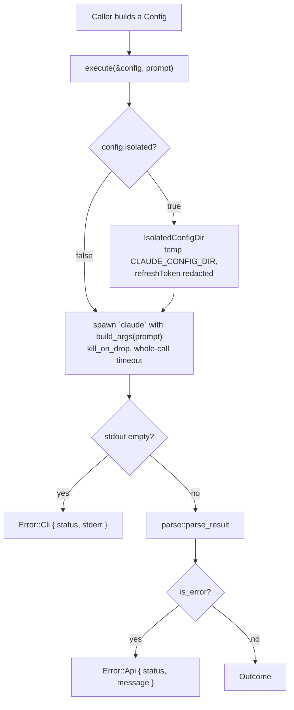

# claude-code-rs — Architecture

This page explains **how one call travels through the crate** — which module does what, and where
a failure comes from. For the field-by-field public surface, read [api.md](api.md); to just get
something running, read the repo [`README.md`](../README.md).

## What this page is for

You are here because a call did something you did not expect, or because you are changing the
crate and need to know what else moves. Read the diagram, then the section that owns the part you
care about.

## Overview

There is no HTTP client here. This is a lean async Rust SDK that drives the `claude` CLI as a
subprocess (`claude -p`), authenticated by the flat-rate subscription the CLI is already logged
into rather than by metered API credits. Everything below is one process spawning another and
parsing its JSON.



In sentences, for the same thing:

1. You build a [`Config`](api.md#config) describing one call.
2. If `Config::isolated` is `true`, `execute()` builds an [`IsolatedConfigDir`](#core-types)
   **before** spawning anything, so a credential problem surfaces without burning a call. That
   build reads the macOS Keychain and blocks, so it runs on tokio's blocking pool
   (`IsolatedConfigDir::new_async`) rather than on the calling task's worker thread — see
   [Why the guard is built off-thread](#why-the-guard-is-built-off-thread).
3. `execute()` resolves the `claude` binary, spawns it with `Config::build_args(prompt)`, and wraps
   the whole thing in a single timeout.
4. An empty stdout means the CLI itself failed; a parsed envelope with `is_error: true` means the
   API call failed. Otherwise you get an [`Outcome`](api.md#outcome).

**The only step you perform is step 1.** The rest is `execute()`.

## Module Map

Six files, each one job. The block ids in parentheses (`CC.1.A`) are this repo's own planning
records and mean nothing to a consumer — ignore them unless you are working the plan.

```
src/
├── lib.rs        ← crate root; re-exports Config/Error/Result/execute/Outcome/IsolatedConfigDir
├── error.rs      ← thiserror crate-level Error enum + Result<T> alias (implemented, CC.0.A)
├── config.rs     ← Config struct + build_args() CLI arg-builder (implemented, CC.1.A)
├── execute.rs    ← async execute(): binary resolution, spawn, whole-call timeout (config.timeout, else 300s), kill_on_drop (implemented, CC.1.A)
├── parse.rs      ← Outcome/Usage/ModelUsage + parse_result(); shape defined by tests/fixtures/ (implemented, CC.1.A)
└── isolation.rs  ← IsolatedConfigDir RAII guard: temp CLAUDE_CONFIG_DIR with redacted credentials (implemented, CC.1.B)
```

`config`, `execute`, `parse`, and `isolation` are all implemented as their own files.
`execute()` applies `Config::cwd`/`Config::env` and, when `Config::isolated` is `true`, builds an
`IsolatedConfigDir` (via `new_async`, on tokio's blocking pool) and sets `CLAUDE_CONFIG_DIR` for the
child process (`CC.1.B`).

## Core Types

Everything a caller touches. All six are re-exported from `lib.rs`, so `use claude_sdk_rs::X`
works for each. Field-by-field detail lives in [api.md](api.md); this list is the orientation.

- **`Error`** (`src/error.rs`) — crate-level error enum via `thiserror::Error`, covering
  `BinaryNotFound`, `Spawn(std::io::Error)`, `Timeout`, `Parse(serde_json::Error)`,
  `Cli { status, stderr }` (the CLI itself failed), `Api { status, message }` (the CLI ran, the API
  call failed), and `Isolation(std::io::Error)` (temp dir creation or a credentials/`.claude.json` source that exists
  but could not be read/copied). Re-exported from `lib.rs`.
- **`Result<T>`** (`src/error.rs`) — crate-wide alias `std::result::Result<T, Error>`, re-exported
  from `lib.rs`.
- **`Config`** (`src/config.rs`) — CLI invocation config: `system_prompt`, `append_system_prompt`,
  `model`, `allowed_tools`/`disallowed_tools`, `continue_session`/`resume`, plus `cwd`/`env` overrides
  (now applied by `execute()` via `Command::current_dir`/`Command::envs`) and the opt-in `isolated: bool`
  switch (default `false`) that routes the call through `IsolatedConfigDir`. Four further opt-ins, all
  inert at their defaults: `dangerously_skip_permissions: bool` (appends
  `--dangerously-skip-permissions`), `json_schema: Option<serde_json::Value>` (`--json-schema`),
  `max_turns: Option<u32>` (`--max-turns <n>`, emitted only when `Some`), and
  `timeout: Option<Duration>` (Rust-side only, never argv). `build_args(prompt)`
  builds the exact argv (always appending `--output-format json`). Re-exported from `lib.rs`.
  Full field-by-field table: [`api.md`](api.md).
- **`IsolatedConfigDir`** (`src/isolation.rs`) — RAII guard that builds a throwaway
  `CLAUDE_CONFIG_DIR` containing a `refreshToken`-redacted copy of `.credentials.json` (mode `0600`,
  sourced from the macOS Keychain then `~/.claude/.credentials.json` fallback) and an optional copy
  of `.claude.json`; removes the temp dir (including on mid-construction failure) on drop.
  `IsolatedConfigDir::new()` uses the real credential sources (and is blocking — `execute()` calls
  the `new_async()` wrapper, which runs it on tokio's blocking pool so the Keychain wait cannot park
  a worker thread); `with_sources(creds_json,
  claude_json_src)` is an injectable constructor for tests. Re-exported from `lib.rs`.
- **`Outcome`** (`src/parse.rs`) — parsed CLI result: `cost_usd` (from `total_cost_usd`), `usage`
  (`Usage`), `model_usage` (`BTreeMap<String, ModelUsage>`, from `modelUsage`), `text` (from
  `result`), `is_error`, `api_error_status`, and `structured_output` (present only when the call
  set `Config::json_schema`). There is **no** top-level `model` field — the model
  name exists only as a `model_usage` key; `Outcome::primary_model()` picks one by a documented
  heuristic (cost, then output tokens, then key order) and returns `None` when none ran.
  Re-exported from `lib.rs`. **The authority for this shape is `tests/fixtures/`** — real captured
  CLI responses — per decision D2, not this page.
- **`Usage`** (`src/parse.rs`) — token counts: `input_tokens`, `output_tokens`,
  `cache_creation_input_tokens`, `cache_read_input_tokens`.
- **`ModelUsage`** (`src/parse.rs`) — per-model counts plus `cost_usd` (from `costUSD`). Note the CLI
  emits these keys in camelCase, unlike the snake_case top-level `usage`.

## Data Flow

The diagram above in prose, with the details it could not carry — env handling, guard lifetime,
and exactly how the two failure modes are told apart.

Caller builds a `Config` → `execute(&config, prompt)` resolves the `claude` binary (`CLAUDE_BINARY`
env var, else `PATH` via `which`), applies `config.cwd` (`Command::current_dir`) and `config.env`
(`Command::envs`, on top of the inherited environment); when `config.isolated` is `true`, builds an
`IsolatedConfigDir` guard first — via `IsolatedConfigDir::new_async`, on tokio's blocking pool —
(surfacing `Error::Isolation` before ever spawning the child) and sets
`CLAUDE_CONFIG_DIR` in the child env, keeping the guard alive until after the child's output is
read — spawns it with `config.build_args(prompt)`, wraps the whole call in one
`tokio::time::timeout` — `config.timeout` when set, else the built-in 300s default
(`kill_on_drop(true)` so a timed-out/cancelled call never leaks a subprocess)
→ CLI emits `--output-format json` → `parse::parse_result` extracts `total_cost_usd`, top-level
`usage`, `modelUsage`, and `result` → `Outcome` returned to the caller. The default (non-isolated,
no overrides) path is unchanged.

## Why the guard is built off-thread

Short version: building the isolated config dir shells out to the macOS Keychain and *waits*, and a
wait on an async worker thread is not a wait — it is a stall for every other task on that runtime.

`IsolatedConfigDir::new()` runs `security find-generic-password` through a synchronous
`std::process::Command` and blocks until it returns. macOS's `securityd` serializes concurrent
keychain reads, so under concurrency that wait is not short. Called directly from `execute()`, it
would park the tokio **worker** thread that picked up the task — the thread that is supposed to be
driving every other future on the runtime — for the whole duration. `execute()` therefore calls
`IsolatedConfigDir::new_async()`, which wraps the construction in `tokio::task::spawn_blocking` so
the wait lands on the blocking pool, where blocking is what the threads are for. Behavior is
otherwise identical, including the best-effort `keychain → file → none` credential fallback; only
the thread the wait runs on changed.

This is not hypothetical. On 2026-09-02 two concurrent isolated calls from `engine-rs` (an
SDLC_FLOW dispatch and an SDLC_TASK dispatch) made the second return `Error::Timeout` against a
120s budget — starved by the first call's keychain read, having never spawned its own subprocess.

**The subtlety worth keeping:** the guard is built *before* the `tokio::time::timeout` wrapper, not
inside it. So a slow keychain read never consumed its **own** call's timeout budget — it consumed
other tasks'. That is why the symptom appeared on an unrelated concurrent call rather than on the
call doing the blocking, and it means any concurrent task could be the victim, not only another
isolated call. Two tests in `src/isolation.rs` pin the fix: one asserts a concurrent task still
makes progress during a slow read on a single-threaded runtime, the other that N concurrent builds
overlap instead of serializing.

Failure routing (two distinct modes, verified against CLI 2.1.211 — the exit code alone cannot
distinguish them, since both exit non-zero):

- **CLI failure** (bad argv, missing prompt): stdout is empty, the message is on stderr →
  `Error::Cli { status, stderr }`.
- **API failure** (unroutable model, outage): stdout carries a well-formed envelope with
  `is_error: true` and **stderr is empty** — the message is in the JSON's `result` field →
  `Error::Api { status, message }`.

`execute()` therefore dispatches on whether stdout is empty, then on `is_error`. It must never
branch on the envelope's `subtype`, which reports `"success"` on both paths.
